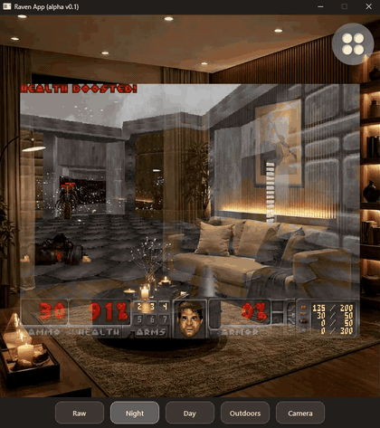

# DOOMed Prism

**Can it run DOOM?** Apparently Raven can. 😅

DOOMed Prism is an experimental DOOM port for Raven Prism smart glasses. The
game already runs inside the Raven Simulator, composited through a Qt‑painted
shared‑memory framebuffer. The ridiculous part is intentional. The engineering
underneath it is not.



*The patched Crispy Doom engine running [Freedoom](https://freedoom.github.io/)
live inside the Raven Simulator's Night mode — the game surface is a Qt widget,
not a native SDL window.*

## Current status

**Milestone 2 is complete: framebuffer integration is viable.** Real DOOM frames
are visible and updating inside the Raven Simulator.

- Validated on Windows 11 in **Raw, Night, Day, Outdoors and Camera** modes —
  live, updating pixels composited by the real Raven Simulator compositor.
- Linux x86_64 build is validated in GitHub Actions.
- The POSIX `shm_open` runtime path is exercised in CI: a valid 640×480
  shared‑memory segment, a validated header, an advancing `frame_counter`, and a
  clean teardown that leaves no `/dev/shm` segment behind.
- The Crispy Doom pin in `crispy-doom.lock` is now actually enforced, not just
  recorded.
- The Python test suite is **103 passed, 5 skipped** (the skips are POSIX‑only
  tests that do not run on Windows).

**Not yet validated:** ARM64, and real Raven Prism hardware. The simulator is an
optical preview, not the device.

## What comes next

Milestone 3 is about input — because right now the only thing you can do is
watch DOOM run.

- **Gaze** to steer and turn.
- **Double blink** as a deliberate action — probably `FIRE`.
- **Voice** for menus and weapon switching.
- A spoken **"pew pew"** as a fire command. This one is not a joke; it is a
  design goal.

None of these exist yet.

## How it works

```
Crispy Doom
  ↓  patched framebuffer exporter (opt-in via DOOMED_PRISM_FB_NAME)
shared-memory triple buffer
  ↓  pewpew.framebuffer.FrameReader  (stdlib mmap, zero-copy)
Qt-painted Raven viewport  (a plain QWidget, no native window)
  ↓
Raven Simulator compositor  (QWidget.grab())
```

- No native Win32 window reparenting anymore.
- The shared‑memory framebuffer is now the rendering foundation.
- Because the viewport is an ordinary Qt‑painted widget, Raven captures the
  result through its own `QWidget.grab()` compositor, in every mode.

## Why shared memory?

Milestone 1 tried the obvious thing: launch Crispy Doom as a normal process and
reparent its native SDL window into the Qt app with `SetParent`.

The Win32 embedding itself worked — correct geometry, correct DPI, clean
lifecycle. But Raven Simulator composites applications through
`QWidget.grab()`, which walks the Qt widget tree and never sees a foreign native
child window. In every mode, the embedded game was a blank rectangle.

That architecture was retired. Milestone 2 moved rendering to a shared‑memory
segment the engine writes and a Qt widget paints — and that path passed the same
decision gate M1 failed.

The full investigation lives in [`docs/validation/`](docs/validation/).

## Quick start

Windows is the primary local development path — Raven Simulator validation
happened there.

1. **Python 3.10+.** Install dev dependencies:

   ```bash
   python -m pip install -e ".[dev]"
   ```

2. **Build the patched Crispy Doom engine** (a stock build will not export
   frames — see the next section for prerequisites):

   ```bash
   python scripts/build_crispy.py
   ```

3. **Point the app at the engine and an IWAD.** In PowerShell:

   ```powershell
   $env:DOOMED_PRISM_CRISPY_EXE = "<path printed by build_crispy.py>"
   $env:DOOMED_PRISM_IWAD       = "C:\path\to\freedoom1.wad"
   ```

   Use a lawfully obtained IWAD. [Freedoom](https://freedoom.github.io/) is a
   free, redistributable option. You may instead point `DOOMED_PRISM_IWAD` at a
   commercial `DOOM.WAD` / `DOOM2.WAD` you own — but **never commit an IWAD to
   this repository.**

## Building the patched engine

The app reads frames from a shared‑memory segment that a small, committed patch
(`patches/crispy-doom-fb-export.diff`) adds to Crispy Doom. Build it with
`scripts/build_crispy.py`, not a stock checkout.

**Prerequisite:** a C toolchain plus SDL2, SDL2_mixer, and SDL2_net development
libraries.

- Windows (MSYS2 UCRT64):

  ```bash
  pacman -S mingw-w64-ucrt-x86_64-toolchain mingw-w64-ucrt-x86_64-cmake \
      mingw-w64-ucrt-x86_64-ninja mingw-w64-ucrt-x86_64-pkgconf \
      mingw-w64-ucrt-x86_64-SDL2 mingw-w64-ucrt-x86_64-SDL2_mixer \
      mingw-w64-ucrt-x86_64-SDL2_net
  ```

- Linux: the equivalent toolchain plus `libsdl2-dev`, `libsdl2-mixer-dev`,
  `libsdl2-net-dev`.

**Usage:**

```bash
python scripts/build_crispy.py            # fetch the pinned tag, apply the patch,
                                          # build; prints the built exe path
python scripts/build_crispy.py --check    # verify the pin and that the patch
                                          # applies cleanly; no build
python scripts/build_crispy.py --check --offline   # same, skipping the tarball
                                          # download (the commit pin is still checked)
python scripts/build_crispy.py --clean    # remove the build directory
```

**The pin is enforced.** After cloning the tag, the checkout's
`git rev-parse HEAD` must equal `commit` in `crispy-doom.lock` — a moved upstream
tag aborts the run — and `tarball_sha256` is verified against the GitHub tag
archive, downloaded with the Python standard library. `--offline` skips only that
download.

**Windows git‑on‑`PATH` hazard:** MSYS2 ships its own `git` in
`C:\msys64\usr\bin`, and it can fail to apply the patch where Git for Windows'
`git` succeeds. If `git apply` fails with "patch does not apply" even though the
patch is fine, keep `C:\msys64\usr\bin` off `PATH` — only
`C:\msys64\ucrt64\bin` (the compiler) is needed there.

**Windows runtime DLLs:** the built `crispy-doom.exe` dynamically links SDL2,
SDL2_mixer, and SDL2_net. Add the toolchain's `bin` directory to `PATH` when
launching it, or copy those DLLs next to the executable.

## Validation and CI

GitHub Actions (`.github/workflows/ci.yml`) runs, on `ubuntu-latest`:

- `pytest`
- publication safety — working tree and full history
- `build_crispy.py --check` (patch applies + pin verified)
- a real Linux build of the patched engine
- a **POSIX runtime smoke test**: launch the built engine with a
  distro‑provided Freedoom IWAD, attach with `FrameReader`, and assert a valid
  640×480 segment, an advancing `frame_counter`, and a clean teardown with no
  leftover `/dev/shm` segment.

What this does and does not prove:

- **Windows + Raven Simulator** is the actual proof that Raven's compositor
  captures the game. CI does not run the Raven Simulator.
- **Linux CI** proves the portable pieces — the build, the shared‑memory
  protocol, the teardown — independently of Raven.
- **ARM64** remains outstanding.

## Publication safety

Every commit must be safe to publish. The repository must never contain Raven
framework source, commercial DOOM game data, IWADs, executables, shared
libraries, or credentials.

```bash
python scripts/check_publication_safety.py --root .
python scripts/check_publication_safety.py --root . --history
```

## License

Original DOOMed Prism / PewPew Engine code is licensed under GPL-2.0-or-later.
Crispy Doom is covered by its own upstream license; this repository contains
only the frame‑export patch and a pinned reference to Crispy Doom, never its
source. Source distributions include the canonical GPL-2.0 text and deliberately
exclude the test suite, whose dependencies are development‑only.
